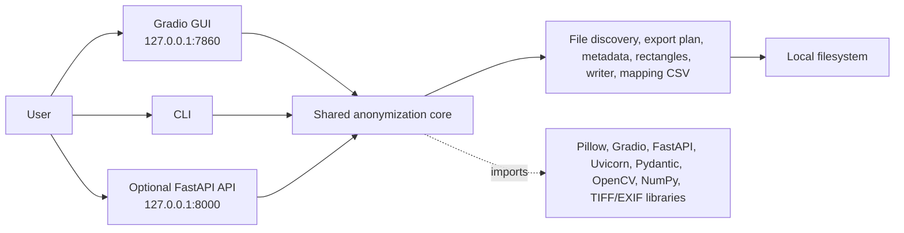
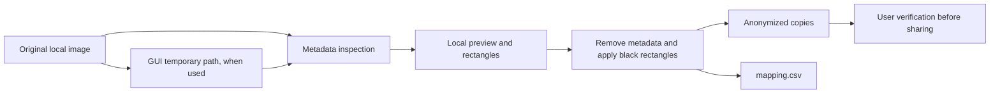

# Clinical Image Anonymizer - ACTA IT and Security Review

**Review date:** 14 July 2026  
**Review baseline:** `v1.0.1`, commit `9c23bf68f5bde061e61d397e04b2f115ee16aeec`  
**Repository:** https://github.com/RKronoXR/clinical-image-anonymizer  
**Intended deployment:** Local ACTA-managed Windows workstation

## 1. Executive summary

Clinical Image Anonymizer is a local-first research prototype that reads 2D clinical image files, displays available metadata, applies user-defined black censoring rectangles, and writes renamed anonymized copies plus a `mapping.csv` report. The GUI, CLI and optional REST API reuse the same anonymization core.

The reviewed Windows GUI listens on `127.0.0.1:7860`. The optional API is designed to listen on `127.0.0.1:8000`. No cloud service is required by the reviewed anonymization workflow, and no application code path was found that uploads clinical images to an external service.

**Assessment:** suitable for a controlled local pilot only after the high-priority dependency and build-remediation actions in Section 7 are completed. It should not be exposed to a LAN or the public internet in its current form. This review does not establish zero risk.

## 2. Architecture and module connections

| Component | Responsibility |
|---|---|
| `src/webapp` | Gradio UI, uploads, previews, rectangle state and export actions |
| `src/cli` | Local command-line input discovery and batch parameters |
| `src/api` | Optional HTTP request validation and REST endpoints |
| `src/anonymization` | Shared metadata, rectangle and export pipeline |
| Local filesystem | Input images, temporary GUI files, anonymized outputs and `mapping.csv` |
| Installer | PyInstaller executables and Inno Setup package |

## 3. Data flow

- Original input files are intended to remain unchanged.
- Outputs are written to a user-selected folder.
- `mapping.csv` contains original filenames, full source paths, output paths, status and errors. It must be treated as sensitive.
- GUI uploads use Gradio-managed temporary paths. The application does not currently implement explicit secure deletion or a documented retention period.
- User verification remains mandatory because metadata removal and manual rectangles do not guarantee complete anonymization.

## 4. Network connections

| Interface | Default bind | Purpose | Current approval position |
|---|---|---|---|
| GUI | `127.0.0.1:7860` | Local browser interface | Acceptable for a controlled local pilot after remediation |
| REST API | `127.0.0.1:8000` | Optional local automation | Disable unless required; localhost only |
| Docker Compose | Host port `7860` is published | Containerized GUI | Do not use as currently written without loopback-only binding and container hardening |
| Outbound | None required by reviewed anonymization code | Normal processing is local | Deny or monitor according to ACTA policy |

The API has no authentication, TLS or path allowlist. A LAN deployment is therefore outside the recommended scope.

## 5. System permissions and installation

- Installation targets `Program Files`, so installer elevation may be requested.
- Runtime requires read access to selected input files and write access to the selected output and temporary directories.
- The installer creates Start Menu/Desktop shortcuts and can optionally add the application folder to the current user's `PATH` through `HKCU`.
- No Windows service, kernel driver, scheduled task or background agent is installed.
- PyInstaller specifications enable UPX and do not configure code signing.

## 6. Dependency and vulnerability findings

| Package | Finding | Relevance |
|---|---|---|
| Pillow 11.3.0 | Published 2026 vulnerabilities include crafted-file memory corruption and denial-of-service issues. Later 12.2.0 and 12.3.0 releases contain fixes. | Relevant because Pillow parses uploaded image files. Upgrade before pilot. |
| Gradio 5.50.0 | Published advisories fixed in 6.6.0/6.7.0 include OAuth, `gr.load()` SSRF and a Windows Python 3.13+ path issue. | OAuth and `gr.load()` are not used; Python is constrained to 3.12. Version upgrade is still required. |
| Starlette 0.52.1 | Published 2026 advisories include Windows StaticFiles SMB/NTLM exposure and request parsing/URL handling issues. | Network isolation reduces exposure, but upgrade with the compatible web stack. |
| Other key packages | Targeted PyPI/OSV checks returned no listed advisories for the reviewed FastAPI, Uvicorn, python-multipart, Pydantic, OpenCV, NumPy, tifffile, piexif and gradio-client versions. | This is not a guarantee. Run a full scanner against the final build. |

Supply-chain issues found in the current manifests:

1. `hf-gradio==0.4.1` requires `gradio-client>=2.0,<3.0`, but `requirements.txt` pins `gradio_client==1.14.0`.
2. `requirements.txt` contains an editable Git dependency that points to commit `251bd302...`, not the reviewed release commit.
3. Build tools and container base image are not pinned to immutable hashes/digests.
4. Development and transitive packages are mixed into the runtime requirements.
5. Version identifiers are not fully aligned between tag, installer, package metadata and application constants.

## 7. Conditions before an ACTA pilot

1. Rebuild from one approved commit after resolving the dependency conflict.
2. Upgrade Pillow, Gradio and the compatible Starlette stack, then run GUI, CLI, API and installer regression tests.
3. Generate the final SBOM and vulnerability report from the exact clean build environment and packaged release.
4. Bind GUI and optional API to 127.0.0.1 only. Block inbound network access in the host firewall.
5. Do not enable the optional API unless ACTA has an explicit operational need for it.
6. Apply ACTA controls for temporary clinical files, output folders and mapping.csv retention.
7. Sign the Windows installer and executables where ACTA policy requires it, and publish SHA-256 checksums.
8. Pilot under a standard user account on an ACTA-managed workstation before broader deployment.

## 8. Maintenance tools

Use these controls on every release and monthly while the software remains deployed:

- `cyclonedx-py`: regenerate the CycloneDX SBOM from the exact clean environment.
- `pip-audit` or `osv-scanner`: scan Python dependencies.
- `Syft` plus `Grype`, or `Trivy`: inspect the packaged application/container and SBOM.
- Dependabot or Renovate: notify maintainers about dependency updates.
- A hash-locked dependency workflow such as `uv lock` or `pip-compile --generate-hashes`.
- GitHub Actions: tests, SBOM generation, license checks and vulnerability gates.

## 9. Complete pinned package inventory

The following inventory is taken from the repository `requirements.txt`. The attached CycloneDX SBOM contains the same machine-readable inventory. Build-time components such as the exact PyInstaller, Inno Setup and UPX versions must be captured from the final controlled build environment.

| Package | Version | Declared license |
|---|---:|---|
| `aiofiles` | `24.1.0` | `Apache-2.0` |
| `annotated-doc` | `0.0.4` | `MIT` |
| `annotated-types` | `0.7.0` | `MIT` |
| `anyio` | `4.14.1` | `MIT` |
| `brotli` | `1.2.0` | `MIT` |
| `certifi` | `2026.6.17` | `MPL-2.0` |
| `click` | `8.4.2` | `BSD-3-Clause` |
| `colorama` | `0.4.6` | `BSD-3-Clause` |
| `fastapi` | `0.138.2` | `MIT` |
| `ffmpy` | `1.0.0` | `MIT` |
| `filelock` | `3.29.4` | `Unlicense` |
| `fsspec` | `2026.6.0` | `BSD-3-Clause` |
| `gradio` | `5.50.0` | `Apache-2.0` |
| `gradio_client` | `1.14.0` | `Apache-2.0` |
| `groovy` | `0.1.2` | `MIT` |
| `h11` | `0.16.0` | `MIT` |
| `hf-gradio` | `0.4.1` | `MIT` |
| `hf-xet` | `1.5.1` | `Apache-2.0` |
| `httpcore` | `1.0.9` | `BSD-3-Clause` |
| `httpx` | `0.28.1` | `BSD-3-Clause` |
| `huggingface_hub` | `1.21.0` | `Apache-2.0` |
| `idna` | `3.18` | `BSD-3-Clause` |
| `iniconfig` | `2.3.0` | `MIT` |
| `Jinja2` | `3.1.6` | `BSD-3-Clause` |
| `markdown-it-py` | `4.2.0` | `MIT` |
| `MarkupSafe` | `3.0.3` | `BSD-3-Clause` |
| `mdurl` | `0.1.2` | `MIT` |
| `numpy` | `2.5.0` | `BSD-3-Clause` |
| `opencv-python` | `4.13.0.92` | `Apache-2.0` |
| `orjson` | `3.11.9` | `MPL-2.0 AND (Apache-2.0 OR MIT)` |
| `packaging` | `26.2` | `Apache-2.0 OR BSD-2-Clause` |
| `pandas` | `2.3.3` | `BSD-3-Clause` |
| `piexif` | `1.1.3` | `MIT` |
| `pillow` | `11.3.0` | `MIT-CMU` |
| `pluggy` | `1.6.0` | `MIT` |
| `pydantic` | `2.12.3` | `MIT` |
| `pydantic_core` | `2.41.4` | `MIT` |
| `pydub` | `0.25.1` | `MIT` |
| `Pygments` | `2.20.0` | `BSD-2-Clause` |
| `pytest` | `9.1.1` | `MIT` |
| `python-dateutil` | `2.9.0.post0` | `Apache-2.0 OR BSD-3-Clause` |
| `python-multipart` | `0.0.32` | `Apache-2.0` |
| `pytz` | `2026.2` | `MIT` |
| `PyYAML` | `6.0.3` | `MIT` |
| `rich` | `15.0.0` | `MIT` |
| `ruff` | `0.15.20` | `MIT` |
| `safehttpx` | `0.1.7` | `MIT` |
| `semantic-version` | `2.10.0` | `BSD-2-Clause` |
| `shellingham` | `1.5.4` | `ISC` |
| `six` | `1.17.0` | `MIT` |
| `starlette` | `0.52.1` | `BSD-3-Clause` |
| `tifffile` | `2026.6.1` | `BSD-3-Clause` |
| `tomlkit` | `0.13.3` | `MIT` |
| `tqdm` | `4.68.3` | `MPL-2.0 AND MIT` |
| `typer` | `0.25.1` | `MIT` |
| `typing-inspection` | `0.4.2` | `MIT` |
| `typing_extensions` | `4.15.0` | `PSF-2.0` |
| `tzdata` | `2026.2` | `Apache-2.0` |
| `uvicorn` | `0.49.0` | `BSD-3-Clause` |
| `websockets` | `15.0.1` | `BSD-3-Clause` |

## 10. Evidence and limitations

- Reviewed repository: https://github.com/RKronoXR/clinical-image-anonymizer
- Stable baseline: `v1.0.1` / `9c23bf68f5bde061e61d397e04b2f115ee16aeec`
- API packaging additionally inspected on `feature/api-installer`, which was one commit ahead of `main` at review time.
- SBOM source: repository `requirements.txt` and `pyproject.toml`, not reverse engineering of a released installer binary.
- Final approval should use an SBOM and scanner report generated from the exact installer delivered to ACTA.

### Primary vulnerability references

- Gradio 5.50.0 metadata and OSV advisories: https://pypi.org/pypi/gradio/5.50.0/json
- Pillow 11.3.0 metadata and OSV advisories: https://pypi.org/pypi/pillow/11.3.0/json
- Starlette 0.52.1 metadata and OSV advisories: https://pypi.org/pypi/starlette/0.52.1/json
- CycloneDX specification: https://cyclonedx.org/specification/overview/
