# Software Engineering Diagrams

This document provides engineering-oriented diagrams for Clinical Image Anonymizer.

The diagrams use Mermaid syntax and are intended for developers, reviewers, maintainers, and future ACTA AI Lab projects that may reuse modules from this repository.

---

## 1. System context

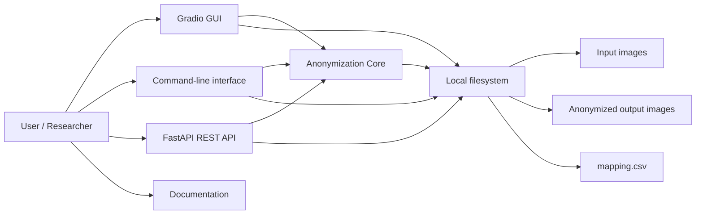

Key point: GUI, CLI, and REST API are thin interfaces over the shared anonymization core.

---

## 2. High-level architecture

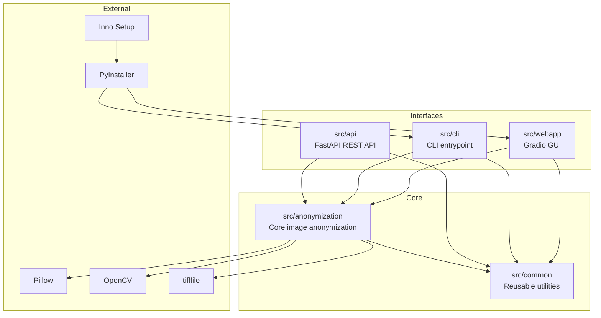

Design rule: project-specific interfaces should not duplicate anonymization logic.

---

## 3. Main module dependency diagram

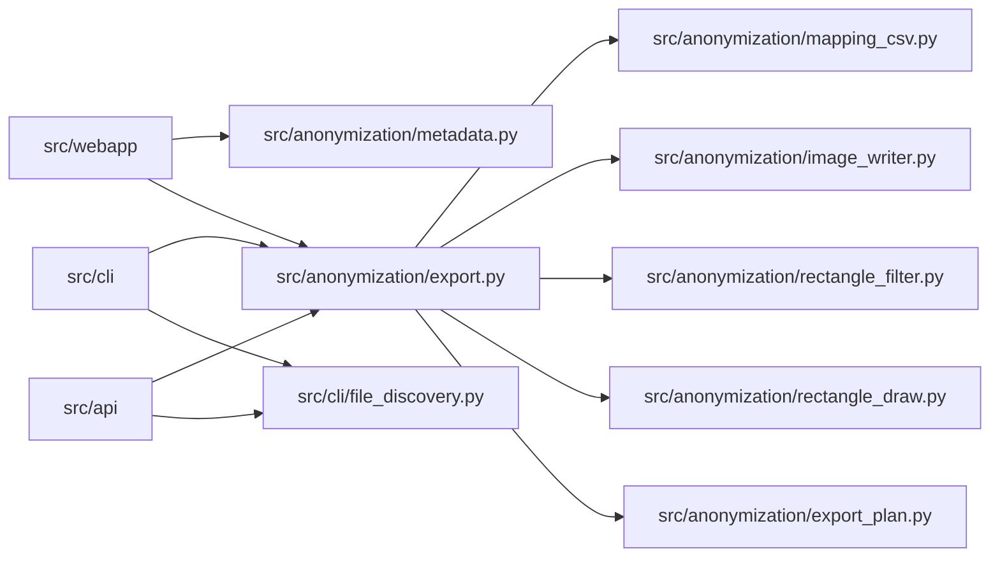

The REST API intentionally reuses CLI file discovery and the shared export pipeline.

---

## 4. Use case diagram

```mermaid
flowchart TB
    Researcher["Researcher / User"]
    Developer["Developer"]
    InstallerUser["Windows user"]
    Maintainer["Maintainer"]

    subgraph System["Clinical Image Anonymizer"]
        UC1["Install application"]
        UC2["Open GUI"]
        UC3["Upload image batch"]
        UC4["Inspect metadata"]
        UC5["Draw or define censoring rectangles"]
        UC6["Preview anonymized images"]
        UC7["Export anonymized images"]
        UC8["Run CLI batch export"]
        UC9["Run REST API batch export"]
        UC10["Run tests"]
        UC11["Build installer"]
        UC12["Update documentation"]
    end

    InstallerUser --> UC1
    Researcher --> UC2
    Researcher --> UC3
    Researcher --> UC4
    Researcher --> UC5
    Researcher --> UC6
    Researcher --> UC7
    Researcher --> UC8
    Researcher --> UC9

    Developer --> UC10
    Developer --> UC11
    Developer --> UC12
    Maintainer --> UC10
    Maintainer --> UC11
    Maintainer --> UC12
```

---

## 5. GUI batch anonymization sequence

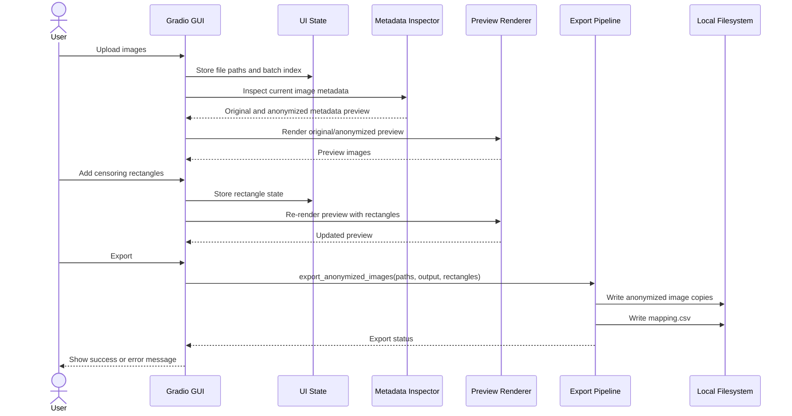

---

## 6. CLI batch anonymization sequence

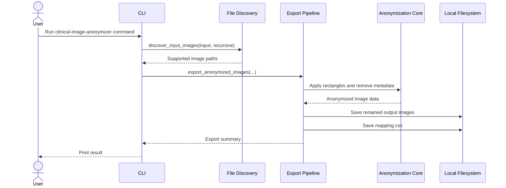

---

## 7. REST API batch anonymization sequence

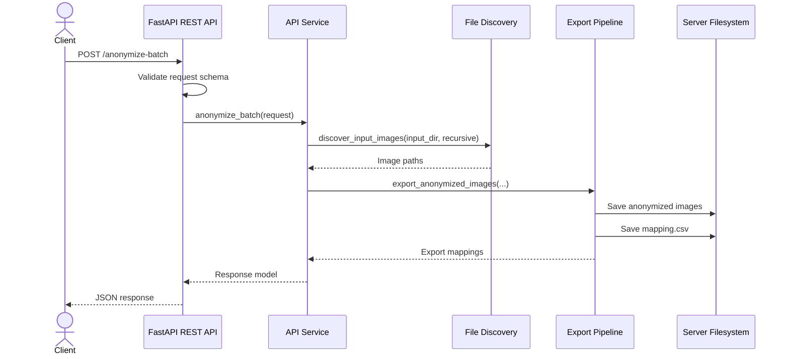

Important: API paths are interpreted on the server machine, not the client machine.

---

## 8. Export pipeline activity diagram

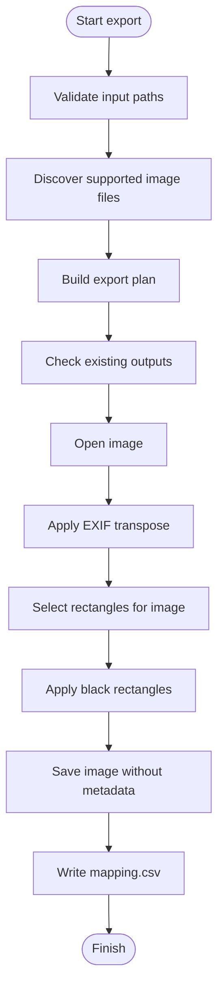

---

## 9. Output naming and mapping flow

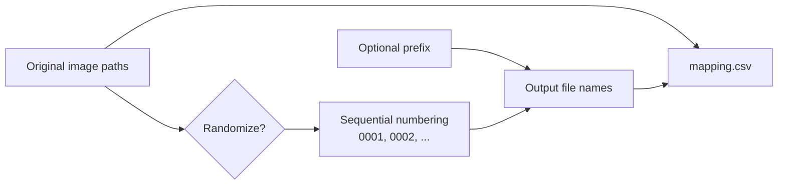

The mapping file links original filenames to anonymized output filenames.

---

## 10. Rectangle application logic

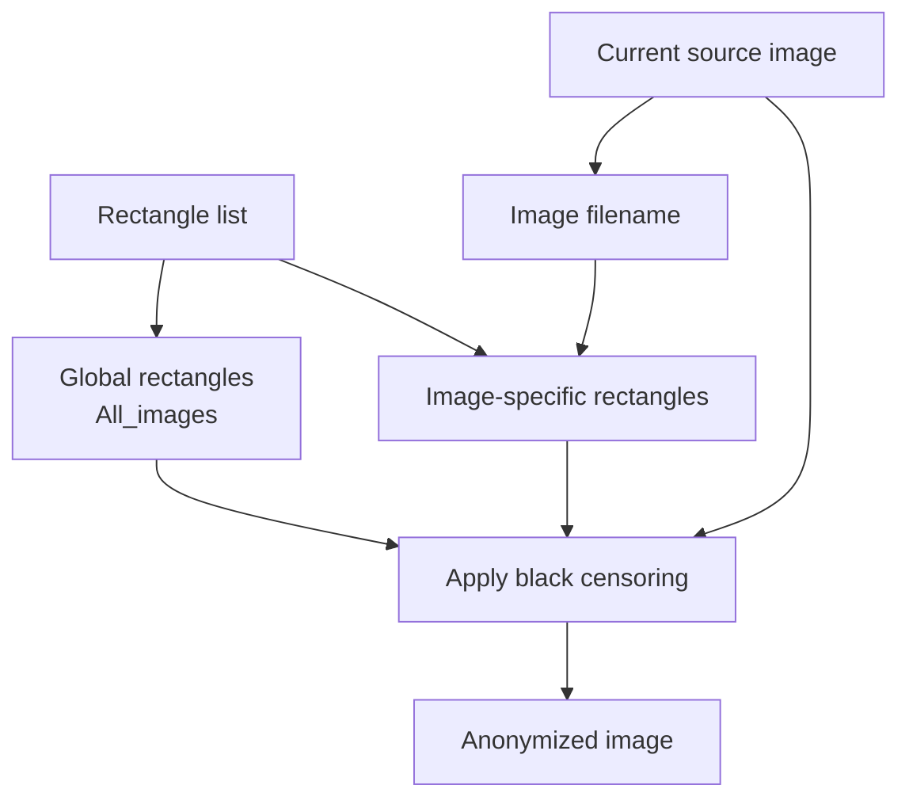

Rectangles can apply to all images or only to a named image.

---

## 11. REST API deployment modes

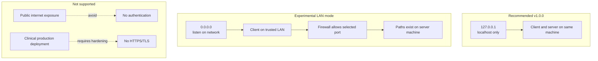

The REST API can be used on a network only under the user's responsibility and only with appropriate privacy/security controls.

---

## 12. Build and release flow

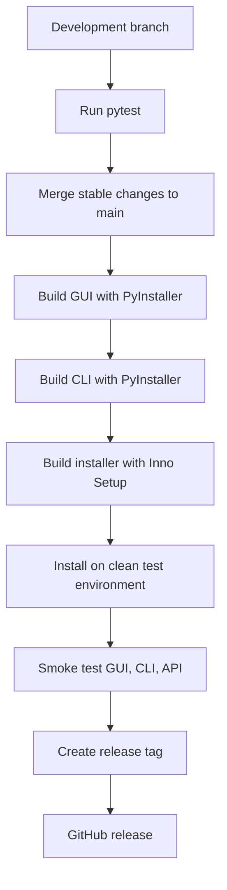

Release tags should be created only after GUI, CLI, REST API, installer, documentation, and final smoke tests pass.

---

## 13. Component responsibility matrix

| Component | Responsibility | Should not do |
|---|---|---|
| `src/anonymization` | Core image anonymization, metadata handling, export plan, mapping CSV | Own GUI/API/CLI behavior |
| `src/webapp` | Gradio UI and user interaction | Duplicate anonymization logic |
| `src/cli` | Terminal interface and file discovery | Implement separate export logic |
| `src/api` | HTTP request validation and REST endpoints | Implement separate image processing |
| `src/common` | Reusable utilities | Contain project-specific UI flow |
| `installer/` | Windows installer script | Contain application logic |
| `docs/` | User, developer, API, and installer documentation | Store generated outputs or private data |

---

## 14. Future architecture extensions

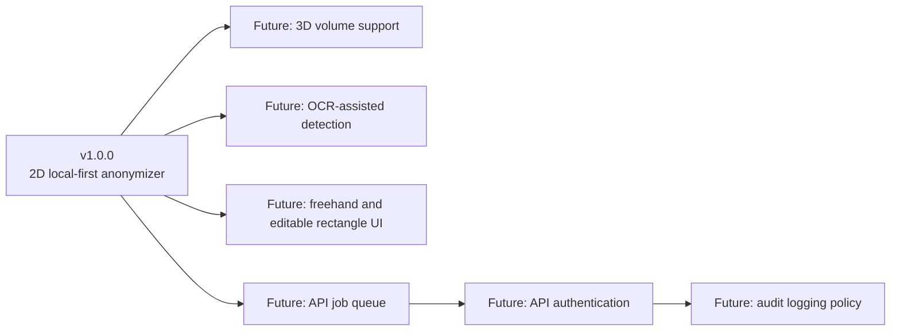

Future features should remain modular and should reuse existing core abstractions where possible.
